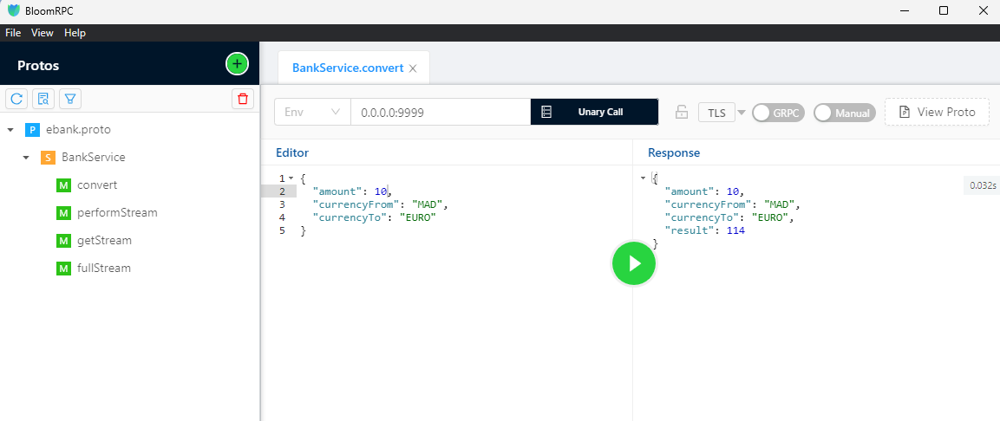

# gRPC Web Service Demo

Ce projet démontre comment créer et consommer un service Web gRPC en utilisant Java. Les quatre modèles de gRPC sont implémentés : Unary, Server Streaming, Client Streaming, et BiDirectional Streaming.

## Fonctionnalités

- Conversion de devises avec différents modèles de communication gRPC
  - Unary Model
  - Server Streaming Model
  - Client Streaming Model
  - BiDirectional Streaming Model

## Prérequis

- Java Development Kit (JDK)
- Apache Maven
- IntelliJ IDEA (optionnel)
- BloomRPC (ou tout autre outil de test gRPC)

## Utilité de gRPC

gRPC (gRPC Remote Procedure Calls) est un framework d'appel de procédure distante développé par Google. Il permet aux applications de communiquer de manière efficace, rapide et évolutive. gRPC utilise HTTP/2 pour le transport, Protocol Buffers comme format de sérialisation, et fournit des fonctionnalités telles que la diffusion de flux bidirectionnelle, la gestion de la concurrence et des délais d'attente, l'annulation de l'appel, et bien plus encore.

## Déploiement du Service gRPC

1. Clonez le dépôt:
   ```bash
   git clone https://github.com/ELMOUADDIBE/Demo_gRPC
   ```

2. Compilez et exécutez le serveur gRPC:
   ```bash
   mvn clean install
   mvn exec:java -Dexec.mainClass="ma.enset.server.GrpcServer"
   ```

3. Le serveur gRPC sera démarré sur le port `9999`.

## Tester avec BloomRPC

1. Ouvrez BloomRPC et chargez le fichier `.proto` pour générer les services.
2. Configurez les appels aux méthodes et testez les différents modèles.

   

## Architecture du Service gRPC

Voici l'architecture du service gRPC avec les quatre modèles de communication `ebank.proto`.

```proto
syntax = "proto3";

option java_package = "ma.enset.stubs";

service BankService {
  rpc convert(ConvertCurrencyRequest) returns (ConvertCurrencyResponse);
  rpc performStream(stream ConvertCurrencyRequest) returns (ConvertCurrencyResponse);
  rpc getStream(ConvertCurrencyRequest) returns (stream ConvertCurrencyResponse);
  rpc fullStream(stream ConvertCurrencyRequest) returns (stream ConvertCurrencyResponse);
}

message ConvertCurrencyRequest {
  double amount = 1;
  string currencyFrom = 2;
  string currencyTo = 3;
}

message ConvertCurrencyResponse {
  double amount = 1;
  string currencyFrom = 2;
  string currencyTo = 3;
  double result = 4;
}
```

## Implémentation du Service gRPC

L'implémentation du service gRPC comprend plusieurs parties clés :

### Service gRPC

Le service gRPC est implémenté en utilisant l'interface générée à partir du fichier `.proto`. Il définit quatre méthodes principales correspondant aux quatre modèles de communication gRPC :
- **Unary Model** : Une requête et une réponse unique. Implémentée par la méthode `convert`.
- **Server Streaming Model** : Une requête unique et plusieurs réponses. Implémentée par la méthode `getStream`.
- **Client Streaming Model** : Plusieurs requêtes et une réponse unique. Implémentée par la méthode `performStream`.
- **BiDirectional Streaming Model** : Plusieurs requêtes et plusieurs réponses. Implémentée par la méthode `fullStream`.

### Démarrer le Serveur gRPC

Le serveur gRPC est démarré en utilisant `ServerBuilder` pour lier le service gRPC à un port spécifique (ici, 9999). Une fois démarré, le serveur attend les connexions et les appels de procédure distante.

### Client gRPC

Deux types de clients gRPC sont implémentés :
- **Client gRPC (Modèle Unary)** : Utilise un stub bloquant pour envoyer une requête et recevoir une réponse.
- **Client gRPC (Modèle Asynchrone)** : Utilise un stub asynchrone pour envoyer une requête et traiter la réponse de manière asynchrone.

## Conclusion

Ce demo démontre comment implémenter et consommer un service gRPC en utilisant Java, couvrant les quatre modèles de communication. gRPC offre une communication efficace et rapide, idéale pour les systèmes distribués modernes.